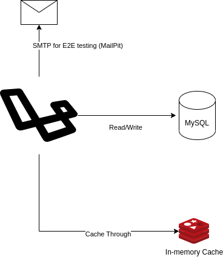
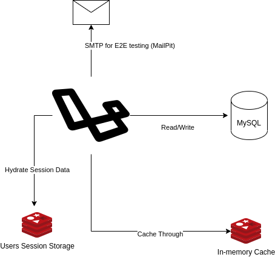
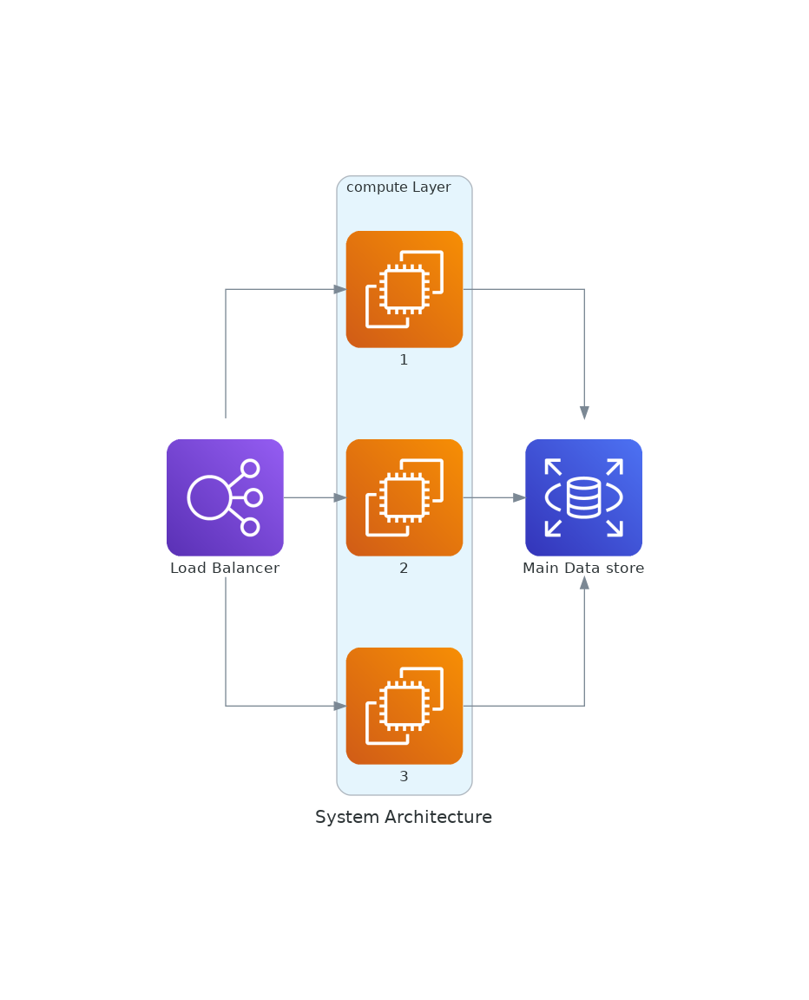
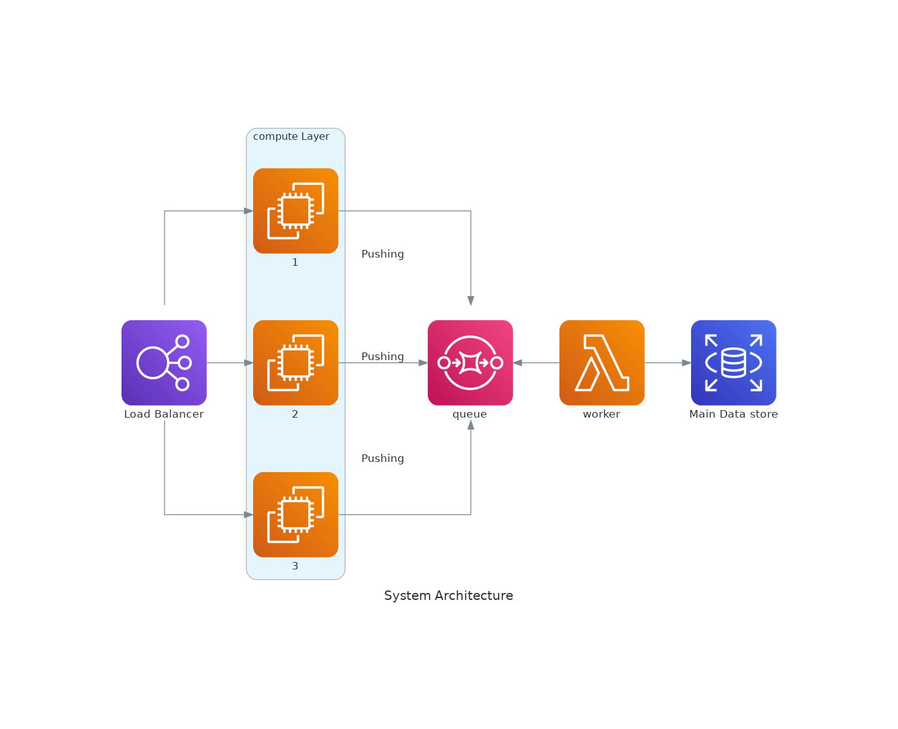
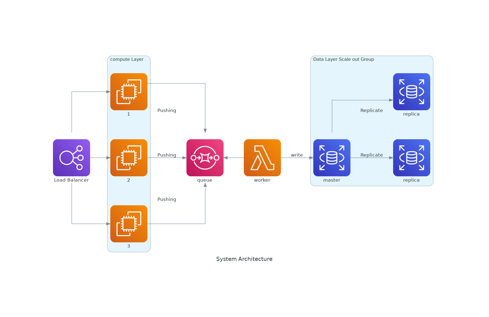

# Main README File

> :warning: Please read this __entire__ file before proceeding with any further steps.

 
# Setup and Design

This project is built using *__Laravel__* on top of *__Laravel sail__*. Primarily, it needs __docker__ do run on a machine.
Docker was used for ease of development, testing, and deployment. The Laravel ecosystem is rich enough with tools to develop __RESTful__ APIs, which this project demonstrates.

### Setup Steps:
> :warning: make sure you have no servers running on port `80` or having any docker containers running as you install the application as
this could conflict with port mapping or docker DNS resolution policies. 

You can use `docker stop $(docker ps -aq)` to stop all running containers. You can then run `docker container prune -f`
 to clear all containers from the docker deamon `dockerd`; leaving space for this project to be run smoothly.
 
1. make sure you have docker installed on your machine by running `docker --version` This project was developed on a `docker 23.0.1` version with a `docker compose` plugin according to the new docker architecture. See the docs for more details.
2. clone the project from its github hub repository [here](https://github.com/Mohammed-Elmasry/foodics-asseessment)
3. `cd` into the directory you cloned the project into.
4. run `php artisan sail:install`
5. run `sail artisan migrate --seed` to run migrations and seeders.
6. run `sail:up` and wait for docker to pull all used images.
7. visit `localhost` and you should see a laravel landing page. This means the project has been setup correctly on top of docker.


### System Design and Architecture

This section contains details about how I thought of this project to be secure, scalable, and, easily, extendable in future iterations. I dealt with this
project as if it was a real-world, projection project. I used `Test-driven Development` to drive the development process and cover the business rules with representative tests.

#### Assumptions:
In this project, I made the following assumptions before I got started:
1. The system is running in 15 countries.
2. Each country has 1000 restaurants.
3. Each restaurant has 3 cashiers.
4. Each cashier is making a request per minute.
 
This gives a total of __15__ X __1000__ X __3__ = __45,000 requests per minute__, or an average of __750 requests per second__.
Those are just the write requests. A modern MySQL Database can handle up to 10,000 concurrent requests per second and the data scheme is highly consistent and relational; making MySQL a perfect Database solution for this system.

As per requirements, PHP-based Laravel framework is used to implement the Application Layer of the system. Laravel version `10.x` has been used and installed using `composer`

#### Initial System Design

The following Diagram shows the initial System Design of the Application's infrastructure:



Laravel uses the MySQL database as the main data store. It performs all __Read/Write__ operations on it. As a means of 
optimization, I use the __Redis__ data store to offload the unnecessary read requests sent on every Order being made to 
retrieve the amount used of every ingredient by every product. If the same order was made 100 times, it would have meant
asking the same question 100 times over. Since the used amount of an ingredient never changes for a given (Product/Ingredient)
combination, caching the answer for the first time and then retrieving it from an in-memory data store would be a lot faster.

The email service __mailpit__ comes preinstalled with *__Laravel Sail__*. It is preconfigured within the __.env__ of Laravel
to uses port 1025 and could be accessed with the browser on `localhost:8025`. This will be used for end-to-end testing 
and evaluation.


### Testing the Application

The system is a __RESTful__ API. It projects an endpoint at `localhost/api/orders` with a __POST__ HTTP method. It is
 recommended to use an API testing tool like __POSTMAN__ to test it. The body will look like the following JSON:
 ```
    {
        "products": [
            {
                "product_id": 1,
                "quantity": 3
            }, {
                "product_id": 3,
                "quantity": 1
            }
        ]
    }
``` 

> :warning: Note that the system will respond with a __422 UNPROCESSIBLE CONTENT__ in case you did not run the 
>seeders and migrated the database. To do that you need to run `sail artisan migrate --seed`

> :warning: Note that it is critical to respect the above contract while testing the API because Validation has been 
>devised to check the contract coming within the HTTP body. Otherwise it will return a __422 UNPROCESSABLE CONTENT__.

> :IMPORTANT: To run all automated tests (i.e. feature and unit tests) run `sail test`.


### Technical Challenges, Performance Issues, and Proposed Enhancements.

For each Write request to make an order in the database, the system needs to perform reads of __m__ products and __n__ 
ingredients to know what product uses what ingredients in what amounts. Assuming each order will contain __p__ number 
products, then each request will have __M__ products made from __N__ ingredients, then the system performs __O__(__M__*__N__)
Read operations per request. Since each of those are done for every Write Request, it is safe to assume the time complexity
of database access could grow exponentially. That is why the repetitive reads for used ingredient amounts was offloaded
from the main data store (MySQL) to the Redis in-memory cache.

## Proposed Enhancements

As this system could grow in size and in the number of concurrent connections, the __Application Layer__ might start 
suffering some performance issues and congestion. To scale the Application out would be the best bet. For that to happen,
I propose a stateless architecture where the session data of, potentially, logged in users could be also kept in an in-memory 
data store like Redis. The following diagrams explains this idea:



Within this architecture, 2 Redis data stores are used: One for the offloading and caching of already read data about 
ingredients and the Other to store session data. This could make it easy to store the Laravel application on Cloud 
(maybe AWS) and balance the load on multiple compute instances behind a load balancer. This could look something like 
the following"


Note that Cache stores are removed for the sake of brevity.

Another potential issue is that too many requests on the data base could cause an issue, especially if the database does 
not scale. One way to avoid losing processable requests would be to decouple the application layer from the __data layer__.
The following diagram illustrates this decoupling using a queue:



Since data is read intensive and that might cause the data to be lost in case of a disaster, I also propose scaling out the data
and replicating it do eliminate any single point of failure across the chain. The following diagram illustrates the final product:



### Final Words

I have only used this documentation to demonstrate my system design capabilities and knowledge in the cloud. This is not 
as an intended verbos of over complicated, over engineered system. It is merely a way to demonstrate my technical 
capabilities and eloquence. I have only used __Laravel Sail__ with __Docker__ and __MySQL__. I have not run a single composer command.
I kept the system's footprint quite minimal and the attack surface quite small.
